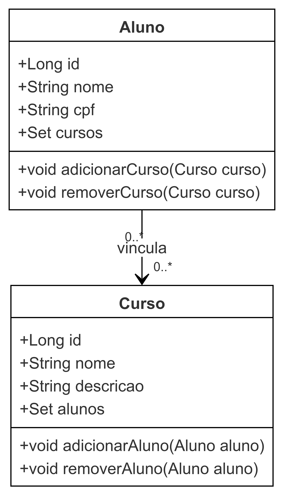

# Projeto de Gerenciamento de Alunos e Cursos

Este projeto é um sistema simples para gerenciar alunos e cursos. Ele permite o cadastro de alunos, vinculação de alunos a cursos e a consulta de informações sobre alunos e seus cursos.

## Tecnologias Utilizadas

- Java
- Spring Boot
- JPA (Java Persistence API)
- H2 Database (ou MySQL)
- Jakarta Validation
- Maven

## Funcionalidades

- **Cadastro de Alunos**: Permite adicionar novos alunos ao sistema.
- **Listagem de Alunos**: Mostra todos os alunos cadastrados.
- **Busca por Aluno**: Permite buscar um aluno específico pelo ID.
- **Atualização de Aluno**: Possibilita a atualização dos dados de um aluno.
- **Deletar Aluno**: Remove um aluno do sistema pelo ID.
- **Vinculação de Aluno a Cursos**: Adiciona um curso à lista de cursos de um aluno.
- **Busca de Alunos por Curso**: Permite buscar todos os alunos vinculados a um curso específico.

## Diagrama de Classes

